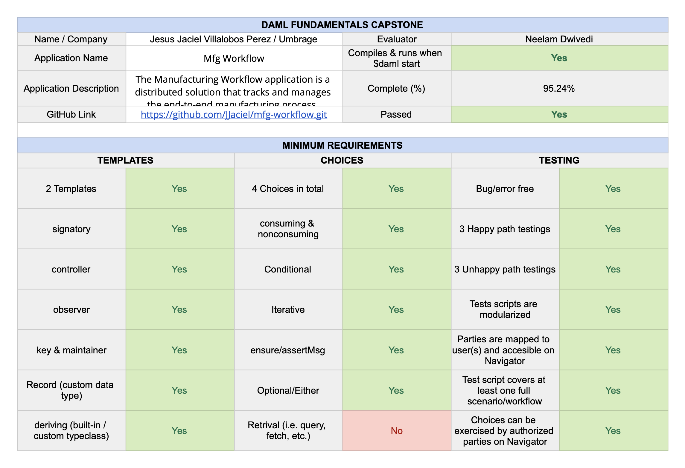

# 🏭  **Manufacturing Workflow App**  📒 
The `Manufacturing Workflow` application is a distributed solution that tracks and manages the end-to-end manufacturing process, ensuring efficient collaboration and quality control from requirement creation to requirement fulfillment. *Built in Daml*.

## **Overview**
This project was created by using the `empty-skeleton` template. The project implements the `proposal-accept` design pattern

### Purpose of the Application
The `Manufacturing Workflow` application is designed to streamline and track the entire lifecycle of a product lot within a manufacturing process. It provides a distributed platform for multiple parties involved in the manufacturing workflow, enabling efficient collaboration, transparency, and accountability. The application ensures that the product lot undergoes required processes and verifications, while maintaining traceability and adherence to standards.

## **Design**
### `Asset`: ProductLot
The primary asset in the `Manufacturing Workflow` application is the ProductLot. A ProductLot represents a specific batch of items that undergoes various manufacturing processes to transform it into a finished product. Each ProductLot is uniquely identified and associated with an specific requirement, processes, and revisions.

### `Parties`
1. Planner: The planner is responsible for creating the initial requirements for the product lot. They define the product and quantity.

2. ProductionManager: The production manager plays a key role in the application. They create the product lot based on the requirements defined by the planner. The production manager is responsible for assigning the product lot to an operator for processing in a given process. They also oversee the overall progress and ensure correct completion.

3. Operator: The operator receives the assigned product lot from the production manager. Their primary responsibility is to carry out the necessary manufacturing processes on the product lot as defined by the workflow. They update the status of each process and prepare the lot for revision.

### `Contracts`
The `Manufacturing Workflow` application utilizes contracts to ensure the integrity and transparency of the process. The following contracts are involved:

- `RequirementAssignment` Contract: Is the proposal created by the planner to assign the Requirement to the Production Manager

- `Requirement` Contract: This contract is created after the RequirementAssignment is accepted and contains the specifications, quantity, and other relevant details for a product lot.

- `ProductLot` Contract: The Production Manager creates this contract based on the Requirement. It includes information such as the unique lot identifier, involved processes, assigned operators, current status, and references to the associated requirement contract.

- `ProcessReview` Contract: Is the proposal created by the Production Manager within the ProductLot to Assign a new process to an operator

- `Process` Contract: Is created when the operator accepts the Process asignation through the ProcessReview. The Operator updates this contract as they progress in the worked hours. After complete it request a review, and a new ProcessReview contract is created so the Production Manager can accept or reject.

These contracts ensure that the workflow progresses in a controlled and auditable manner, enabling parties to track the state of the product lot at each stage and providing a historical record of the entire manufacturing process.

By leveraging the `Manufacturing Workflow` application, the parties involved can collaborate effectively, maintain product quality, and ensure adherence to standards, ultimately leading to improved efficiency and customer satisfaction in the manufacturing process.

## **Workflow**
1. The Planner creates a RequirementAssignment contract, specifying the Requirement.

2. The Production Manager reviews the RequirementAssignment contract and accepts it. A Requirement contract is created with the planner and manager as signatories.

3. The Production Manager creates a ProductLot Contract based on Requirement. They create the processWorkflow which defines the processes to be performed and which operator would perform each.

4. The Production Manager starts assigning the first process and it creates a ProcessReview contract.

5. The Operator review the ProcessReview and accepts it. A Process contract is created

6. The Operator updates the process contracts as they progress in their task adding hours.

6. Once the Operator completes a process, a new ProcessReview contract is created for the manager to Accept or Reject

7. Based on the manager decision
    - If is accepted, the manager can continue with the next process assignment
    - If is rejected, the process is added again to the list as "reprocess", and the rejected process is assigned again to the same operator to be reprocessed

8. When all the processes are completed, the manager Fulfills the requirement, and the Requirement contract is recreated with the updated data.

Throughout the workflow, the parties involved can access the application to monitor the status, progress, and history of the product lot.

## Compiling & Testing
To compile and start the navigator
```sh
daml start
```
To test, in a new terminal run:
```sh
daml test
```

## Evaluation results

